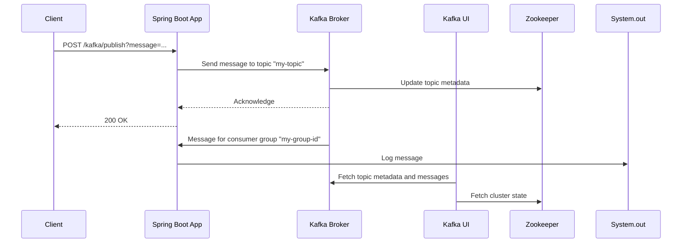

# System Patterns: Spring Kafka Tutorial

## System Architecture

The system follows a simple microservice architecture with a single Spring Boot application interacting with an Apache Kafka cluster.

## Key Technical Decisions

-   **Spring Kafka:** Using Spring Kafka for simplified Kafka integration within the Spring Boot application.
-   **Docker Compose:** Using Docker Compose for easy setup and management of the Kafka cluster and its dependencies.
-   **Kafka UI:** Using Kafka UI for monitoring and managing Kafka topics and messages.
-   **REST API:** Exposing a REST endpoint for sending messages to Kafka.
-   **Kafka Listener:** Using `@KafkaListener` annotation for consuming messages from Kafka.

## Design Patterns

-   **Producer-Consumer:** The core pattern is the Producer-Consumer pattern, where the Spring Boot application acts as both a producer (sending messages) and a consumer (receiving messages).
-   **Microservice:** The Spring Boot application can be considered a microservice that interacts with Kafka for asynchronous communication.
-   **Configuration as Code:** Docker Compose and Spring Boot configuration files (`application.properties`) are used to define the infrastructure and application settings.

## Component Relationships

-   **KafkaController:** Handles incoming HTTP requests and uses `KafkaProducerService` to send messages to Kafka.
-   **KafkaProducerService:** Uses `KafkaTemplate` to send messages to Kafka.
-   **KafkaConsumerService:** Uses `@KafkaListener` to consume messages from Kafka.
-   **KafkaTopicConfig:** Configures Kafka topics using Spring beans.
-   **Zookeeper:** Manages the Kafka cluster state and configuration.
-   **Kafka Broker:** Stores and distributes Kafka messages.
-   **Kafka UI:** Provides a web interface for monitoring and managing Kafka.

## Critical Implementation Paths

1.  **Sending a message:**
    *   Client sends a POST request to `/kafka/publish`.
    *   `KafkaController` receives the request and calls `KafkaProducerService.sendMessage()`.
    *   `KafkaTemplate` sends the message to the specified Kafka topic.
2.  **Receiving a message:**
    *   Kafka Broker sends a message to the consumer group `my-group-id`.
    *   `KafkaConsumerService.listen()` receives the message via `@KafkaListener`.
    *   The message is logged to the console.
